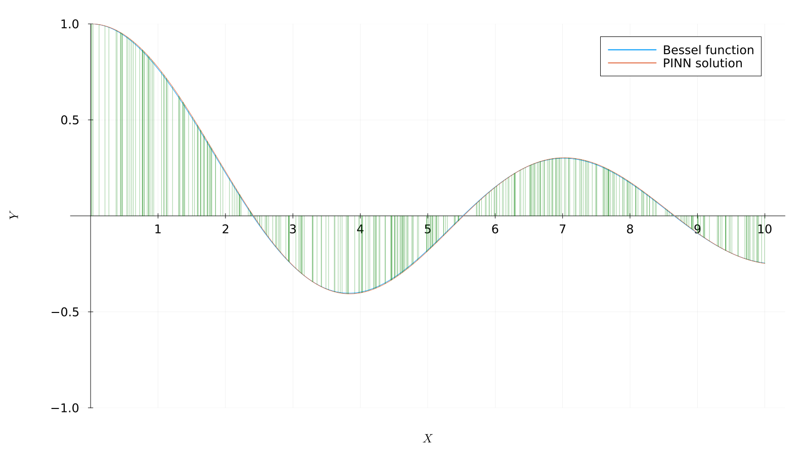
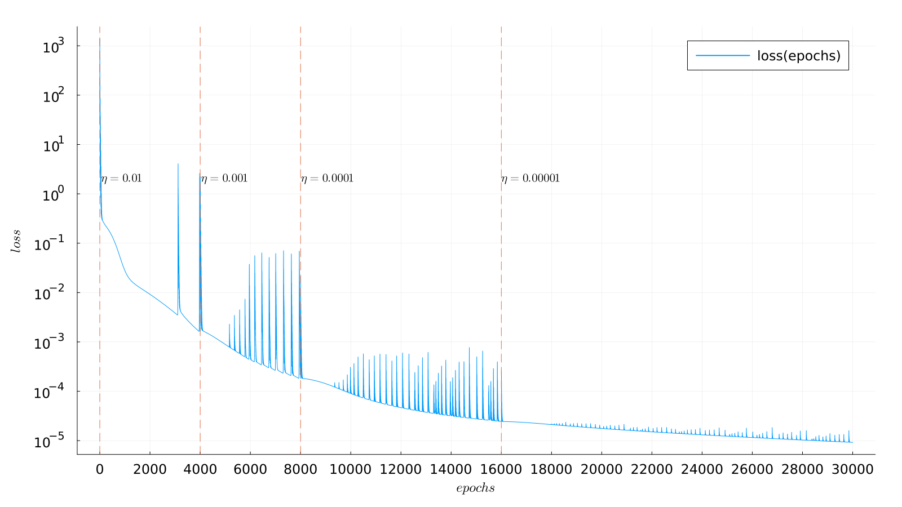
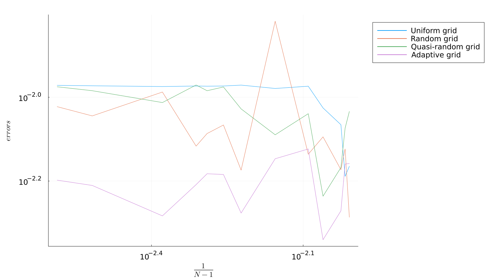

# PINN for Bessel equation on julia

## Setting the task
The Bessel equation looks like this:

$$x^2\frac{d^2y}{dx^2} + x\frac{dy}{dx} + (x^2 - \alpha^2)y = 0$$

Let's research it when $\alpha = 0$ and $\alpha = 1$.
We analyze the values $\alpha = 0$ and $\alpha = 1$ within $x \in [0, 10]$.

```math
\begin{cases}
	x^2\dfrac{d^2y}{dx^2} + x\dfrac{dy}{dx} + x^2y = 0,\\
    y(0) = 1,\\
    y'(0) = 0.\\
\end{cases}

\qquad

\begin{cases}
	x^2\dfrac{d^2y}{dx^2} + x\dfrac{dy}{dx} + (x^2 - 1)y = 0,\\
    y(0) = 0,\\
    y'(0) = 0.5.\\
\end{cases}
```

We investigate various strategies for selecting learning points (uniform grid,
random distribution, adaptive selection, quasi-random sequences) to find Bessel
functions using PINN.

## The method

For a neural network, we will choose a multilayer perceptron with two hidden layers
of $16$ neurons each. The input and output layers will contain one neuron each, since
the Bessel functions are functions of the same variable. It is logical to use $\sin(x)$
as the activation function and Adam optimizer.

## Strategies for selecting learning points

When selecting weights, the optimizer substitutes the value of the function and its
derivatives at selected points in the left part of the differential equation and calculates
the deviation from the right part. The choice of these points significantly affects the
effectiveness of the selection of weights. Let's consider the most popular point selection
methods using the example of choosing $n$ points of the segment $[0, 1]$.

### Uniform grid

The simplest set of points is a uniform one. In this case, we take all the points starting
from $0$ in increments of $\frac{1}{n-1}$ to the point $1$. For example, points will be
selected for $n = 6$ are $0.0, 0.2, 0.4, 0.6, 0.8, 1.0$.

### Random grid

Let's generate $n$ random points from the segment $[0, 1]$ using the standard method of
generating pseudo-random numbers. The default algorithm in `Julia` is `Xoshiro256++`.

### Quasi-random grid

To generate a quasi-random sequence, we use the following algorithm:

$$t_k = \{s_0 + k\phi\}$$

Here $\{x\}$ is the fractional part of the number $x$, and $k$ is the number of the point
in the sample, takes values from $0$ to $n - 1$. The following constants are usually
chosen: $s_0$ and $\phi$:

$$s_0 = 0, \qquad \phi = \frac{1 + \sqrt{5}}{2}$$

In that way, the first few points of the quasi-random sequence will be equal $0.0, 0.618,
0.236, 0.854, 0.472, 0.090, \dots$

### Adaptive grid

To form an adaptive sample, we use the following methodology:

1. Let's split the specified interval with a small number of points, choose the constant $\xi$
(in this study, values from the interval $[0.01, 0.04]$ were used).
2. For each interval $[x_k, x_{k+1}]$, we will verify the validity of the inequality.
$$J_\alpha'\left(\frac{x_k + x_{k+1}}{2}\right) \cdot (x_{k+1} - x_k) < \xi$$
3. If it is false, add the point $\frac{x_k+x_{k+1}}{2}$ to the partition and repeat the check
for a new partition.

## The results of research

You can view all the images in the [images directory](images), here are just a few examples.

In all the figures below, the exact analytical solution is built in blue, the neural network
solution is in orange, the green segments under the graph indicate the split points. On the graphs
of the loss function, the evolution of the loss function is plotted in blue depending on the number
of training epochs. The orange dotted line on the graphs of the loss function indicates the epoch at
which the training parameter $\eta$ changed.

The result of one of the most successful launches for a random grid can be seen on that diagram.




The points on the adaptive grid are located most densely where the value of the Bessel function
changes the fastest. The results of the approximation on an adaptive grid are the best, which is
logically explained by the specialization of the choice of points for research.




Finally, we can compare the maximum absolute deviation from the exact analytical solution on different
grids. The numerical data can be viewed in the files [for $\alpha = 0$](src/losses_errors_0.txt) and
[for $\alpha = 1$](src/losses_errors_1.txt)


